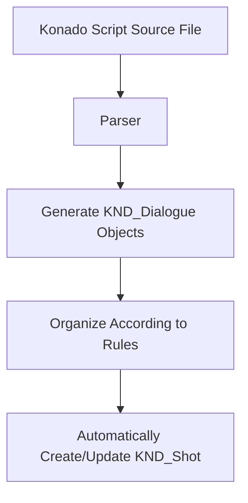

# KND_Shot and KND_Dialogue

## Preface

This chapter will introduce two core classes of Konado: KND_Shot and KND_Dialogue. These two classes are the core of Konado, used to represent dialogue shots and dialogues. If you want to deeply understand the architectural principles of Konado, then understanding these two classes is very important. Based on a full understanding of these two classes, you can extend and modify them according to your needs to meet your requirements.

## KND_Shot

### Definition

KND_Shot is a core class of Konado, used to represent a dialogue shot.

A shot is a basic concept in film and animation production, representing a continuous sequence of frames. Here, the KND_Shot class is used to represent a dialogue shot, which contains a series of dialogues.

Of course, it can also be understood using the concept of a book: a shot is a small chapter, and a dialogue shot is the dialogue in a small chapter.

KND_Shot will be responsible for organizing scattered KND_Dialogue data objects and arranging them in a certain order, so that they can be played in the specified order during playback.

Of course, unlike film shots, KND_Shot does not necessarily represent a continuous, linear story, but may consist of multiple branch branches, each containing a series of dialogues, combined with choice to implement multi-selection branches, allowing users to choose different dialogue paths.

### The Relationship between KND_Shot and Konado Script

In the process of use, you will easily find that by default, KND_Shot does not need to be created manually, but is automatically created by Konado Script and the data is automatically updated. This is because we have adopted a custom Konado Script syntax and used the Konado Script parser to parse script files, by parsing the lines of the source file into KND_Dialogue objects, and then organizing them into KND_Shot objects according to certain rules.

If represented by a flow chart, the process from Konado Script to multiple KND_Dialogue to KND_Shot is roughly as follows:

If you want to learn more about the parsing process of Konado Script, you can refer to the relevant documentation of Konado Script and the source code of the parser.
