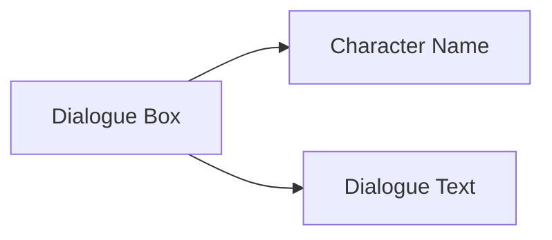

# Normal Dialogue

## Function Description


Normal dialogue is a common interaction method in games, used for communication between characters and players, presenting dialogue content through character names and dialogue text.

## Syntax Structure

```text
[Character] [Dialogue Text] [Voice Tag]
```

## Parameter Description

| Parameter | Required | Example | Description |
|------|------|------|------|
| Character | Yes | `alice` | Character name, used to display in the dialogue box |
| Dialogue Text | Yes | `Hello, my name is Alice!` | What the character says |
| Voice Tag | No | `alice_intro_01` | Optional tag, used to identify voice files |

## Examples

```text
# Normal dialogue
"alice" "Hello, my name is Alice!" alice_intro_01

# Narrator (no character)
"narrator" "The storm is getting more and more intense..."
```
