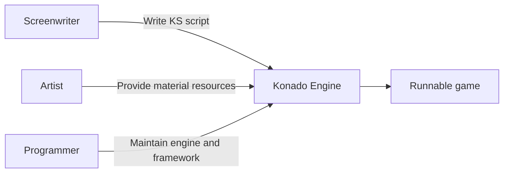

# Konado Scripts

Konado Scripts is a **Domain Specific Language** specifically designed for visual novel games, with the file extension `.ks`. It adopts a plain text format (UTF-8 encoding), allowing developers to describe all elements of visual novels through a concise set of instructions, including plot flow, character performance, scene transitions, branch selection, etc.

Each Konado Scripts script is converted into a KND_Shot object

## Design Philosophy

### 1. Separation of Content and Logic
The core design philosophy of Konado Script is to separate **story content** from **program logic**:
- Screenwriters focus on narrative content without needing programming knowledge
- Programmers focus on engine development without needing to interfere with story creation
- Resource management (images, audio) is referenced through identifiers, decoupled from scripts

### 2. Intuitive Expressiveness
Syntax design simulates human natural expression:
```text
"alice" "Ah! I forgot!"
actor show bob surprised at 400 300 scale 0.8
background sunset fade
```
Each line of instruction intuitively expresses an action or event in the game, close to a film storyboard script.

### 3. Linear Flow and Branch Control
- Default sequential execution, in line with story narrative logic
- Branch plots implemented through `choice` and `jump`
- Chapter-based structure (chapter_id/chapter_name) supports large script management

### 4. Lightweight and Extensible
- Plain text format, small size and fast loading
- Modular instruction set, easy to extend new features
- Compatible with version control systems (Git, etc.)

## Core Advantages

### 1. Improved Development Efficiency

Multi-role parallel work, shortening development cycle by more than 50%.

### 2. Zero Programming Threshold
Non-technical personnel can also participate in development:
- Average learning time for basic instructions < 30 minutes
- Intuitive dialogue system: `"character" "content"`
- Visual editor friendly (future planning)

### 3. Powerful Expressiveness
```text
# Complex scene example
background castle_night blinds
play bgm mystery
actor show vampire smile at -200 450 mirror
actor move vampire 300 450
"vampire" "You're finally here... I've been waiting for this moment for a long time" vamp_voice_07
```

### 4. Cross-platform Compatibility
- Text format is inherently cross-platform
- Resource references are platform-independent
- Parser can be easily ported to various game engines


## Application Scenarios

- AVG text adventure
- Visual novels
- Interactive story games
- Electronic comics/audiobooks
- Game plot prototype design

## Summary

Konado Scripts achieves a perfect balance between **creative freedom** and **development efficiency** through a carefully designed domain-specific language. It retains the flexibility and readability of text scripts while providing sufficient expressive power through structured instructions, transforming visual novel development from technology-intensive to content-oriented creation.
